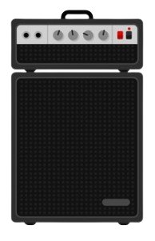

# Alura FrontEnd Immersion

This project offers a hands-on immersion into the fundamentals of web development by recreating Spotify.

## Covered Topics

During this immersion, the following topics were covered:

- 🎼 General review of HTML, CSS, and JavaScript
- 🎶 Responsive layouts using flexbox and grid
- 🎧 CSS responsiveness to ensure a consistent experience across different devices
- 🎵 DOM manipulation to keep the beat alive with dynamic interactivity
- 🎤 Exploration of Angular and React frameworks for web development

  
  
Image by <a href="https://br.freepik.com/vetores-gratis/equipamento-de-estudio-profissional-de-musica_934897.htm#query=amplyfier%20illustration&position=18&from_view=search&track=ais&uuid=e3623951-c1cf-472c-b297-8aaf6ff77b68">Freepik</a>

